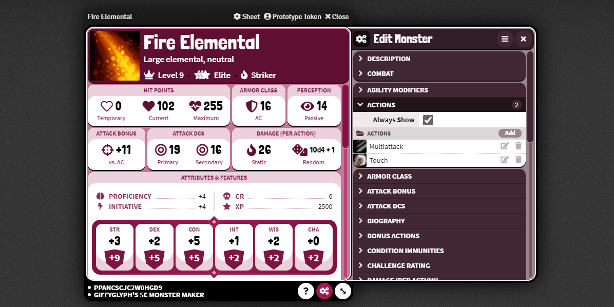
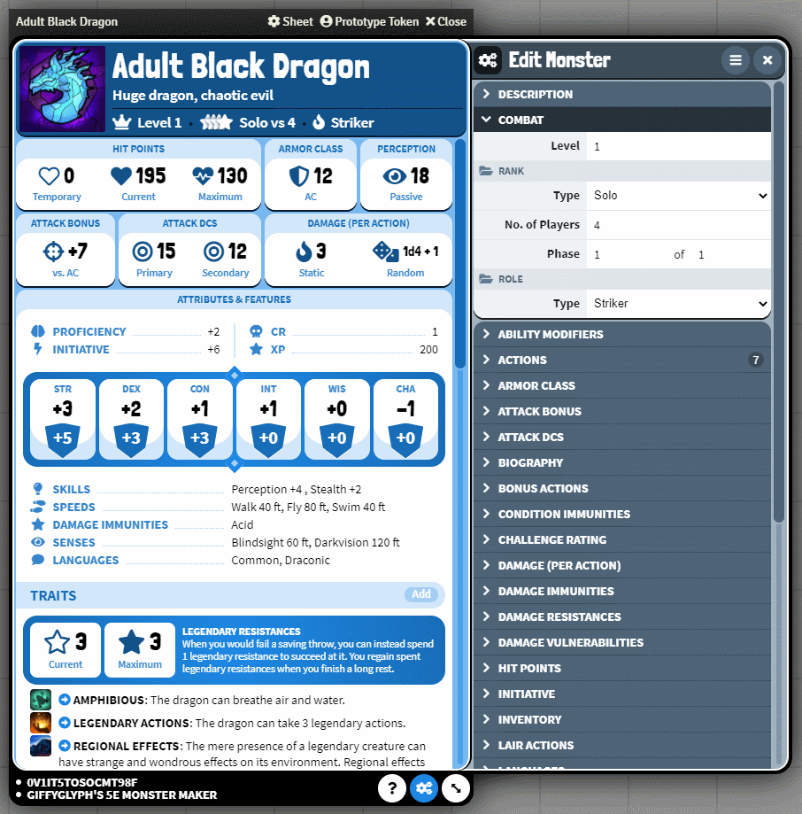
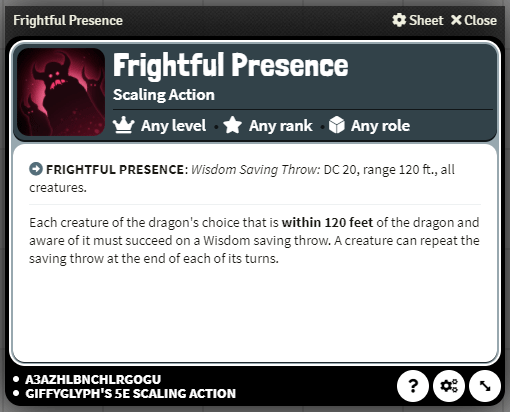

# Giffyglyph's 5e Monster Maker Continued, by Skyl3lazer

This is a continuation of the original module by Giffyglyph, updated to be compatable Foundry v10/11 and D&D 2.2.x.
(Also check out my [v3 updated Webapp!](https://giffyglyphmonstermakerv3.azurewebsites.net/))

**NOTE:** There are still signposting issues around! Not all tooltips, etc, have been updated. Many of the entries in the compendiums are built for v2 as well, so double check your monsters if you use compendium elements.

If you find issues not already listed in [DEV_TODO](https://github.com/Skyl3lazer/giffyglyph-monster-maker-continued/blob/master/docs/DEV_TODO.md) please leave an Issue here or contact me @Skyl3lazer on Discord.

Want to build new monsters for your [Foundry VTT](https://foundryvtt.com/) D&D 5e campaign, but aren't sure how to balance them easily? No worries—**Giffyglyph's 5e Monster Maker** has you covered! Build level-appropriate D&D 5e monsters in _seconds_ with an all-new automated monster sheet and scaling actions.

## Features

* A brand new monster sheet with customisable themes.
* Fully-scaled monster stats for levels -5 to 50.
* 4 monster roles — minion, standard, elite, and paragons.
* 6 combat roles — controller, defender, lurker, skirmisher, striker, and supporter.
* Change the level of any monster on-the-fly and watch their stats change.
* A new scaling action sheet with fully-scaling attacks.
* Easy-to-use shortcodes to make scaling features even easier.
* Convert existing monsters in seconds by simply changing the active sheet.
* Includes full stats from the **[Giffyglyph's Monster Maker PDF](https://giffyglyph.com/#giffyglyphs-monster-maker)**.

## Installation

### Dependencies

* [libwrapper](https://foundryvtt.com/packages/lib-wrapper/) - Allows GGMMC to interact more nicely with other modules, such as MidiQOL.

---

You can install this Foundry module by copying a manifest URL into your Foundry setup:

* **v3 RC 0.11.x (Main Release):** https://raw.githubusercontent.com/Skyl3lazer/giffyglyph-monster-maker-continued/master/module.json	
  * This is probably what you want
* **v3 Dev 0.12.x (May be unstable):** https://raw.githubusercontent.com/Skyl3lazer/giffyglyph-monster-maker-continued/dev/module.json
  * For the Brave

* **MM v2 (Legacy, only for recovering monsters from old games):** https://raw.githubusercontent.com/Skyl3lazer/giffyglyph-monster-maker-continued/v2/module.json
  * This is the original GGMM v2 module, only updated for Foundry v10 / dnd5e 2.1+. It won't be getting bugfixes, it's just for data recovery.

You can install multiple branches side-by-side, but you must activate only **one branch at a time**.

## Incompatibilities / Differences

* Some modules may have limited functionality with shortcodes in various fields. If you attempt to roll something and it doesn't roll, please submit an issue with your modlist.

## Getting Started

1. Install and activate the module.
2. On the sidebar under "Actors, you will see **"Create a Scaling Monster"**. Click it.
3. Customise your monster by changing the level, rank, and role. See your monster's stats update live with each change.
4. On the sidebar under "Items", you will see **"Create a Scaling Action"**. Click it. You can also click the "Add" button next to the Actions section on your monster.
5. Customise your action by adding an attack — try a _"Melee Weapon Attack"_!
6. Now drag the scaling action onto your scaling monster, and watch the action's attack bonus automatically change to match your monster's bonuses.

### Converting an old Monster

1. Open an existing monster, or import one from the SRD compendium.
2. Change the active sheet to **"Giffyglyph's 5e Monster Maker"**.
3. Change the monster's level, rank, and role to suit the expected encounter.

### Converting an old Action

1. Open an existing item, such as a weapon, feature, or piece of loot.
2. Change the active sheet to **"Giffyglyph's 5e Scaling Action"**.
3. Customise the action with some scaling features and shortcodes.

## Roadmap

Currently this release can handle GGMMv3 functions as a standalone module, with some basic integrations working through other modules (MidiQOL, DAE). See [DEV_TODO](https://github.com/Skyl3lazer/giffyglyph-monster-maker-continued/blob/master/docs/DEV_TODO.md) for what I'm looking at next.

## Thank Yous!

Big shoutout to **@krigsmaskine** on Discord for assistance with the [tsponey](https://github.com/tposney) modules and general testing

## Bugs and Feature Suggestions

If you notice a bug or have a feature suggestion, visit the **[issue board](https://github.com/Skyl3lazer/giffyglyph-monster-maker-continued/issues)** and open a ticket. Please make sure to be as thorough as possible in your report and attach screenshots where appropriate, as low-effort tickets may be closed out-of-hand.

## Support

You can also see an updated GGMMv3 webapp I've created [here](https://giffyglyphmonstermakerv3.azurewebsites.net/)

If you'd like to support the original creator of this module, please consider [becoming a patron](https://www.patreon.com/giffyglyph). You can also find more of Giffy's work at:

* [giffyglyph.com](https://giffyglyph.com)
* [twitter](https://twitter.com/giffyglyph)
* [twitch.tv/giffyglyph](https://twitch.tv/giffyglyph)

## Licensing

This module is licensed under the [Foundry Virtual Tabletop EULA: Limited License Agreement for module development](https://foundryvtt.com/article/license/).
